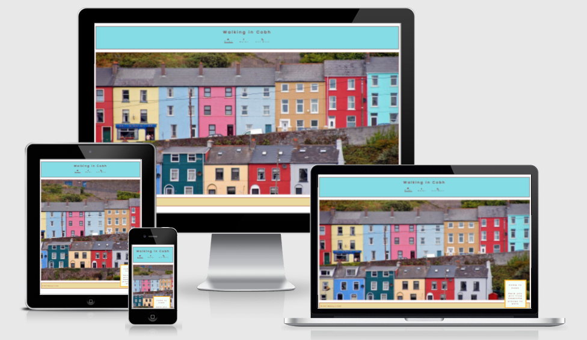

# Walking in Cobh

## Purpose

Walking in Cobh website is dedicated to invite people to visit Cobh. It is intended to invite people who love to walk to come to walk in Cobh.

## Features 

### Existing Features

- __Navigation Menu__

* Located where the user expects this kind of element to be located, i.e. in the top of the page.
* Same colors and same general appearance all over the pages.
* Responsive.
* Gives the users a clue about where they are in the site.

- __The Landing Page__

With a beautiful picture of the Cobh colored houses, this page is inviting the user to come to Cobh, in its main section.

There is a message saying "Come to Cobh" (hero-message) in a positioned div that has an absolute position and is a child of a positioned div that has a relative position and has that picture of the colored houses (hero-image) as its background image. So the hero-message is positioned relative to the hero-image and it is positioned outside of the boundaries of that image, to draw the attention of the user.

- __The Footer__

...

- __The Walks Page__

...

- __The Get Here Page__

...

### Features Left to Implement

...

## Testing 

...

### Validator Testing 

- HTML
  - No errors were returned when passing through the official [W3C validator](https://validator.w3.org/nu/?doc=https%3A%2F%2Fcode-institute-org.github.io%2Flove-running-2.0%2Findex.html)
- CSS
  - No errors were found when passing through the official [(Jigsaw) validator](https://jigsaw.w3.org/css-validator/validator?uri=https%3A%2F%2Fvalidator.w3.org%2Fnu%2F%3Fdoc%3Dhttps%253A%252F%252Fcode-institute-org.github.io%252Flove-running-2.0%252Findex.html&profile=css3svg&usermedium=all&warning=1&vextwarning=&lang=en#css)

### Unfixed Bugs

...

## Deployment

- The site was deployed to GitHub pages. The steps to deploy are as follows: 
  - In the GitHub repository, navigate first to the Settings tab and then to the GitHub Pages tab.
  - From the source section drop-down menu, select the main branch and then Save this change.

The live link can be found here - https://jmarcosdias.github.io/awesome/index.html 

## Credits 

### Content 

- The icons in the navigation menu were taken from [Font Awesome](https://fontawesome.com/).

### Media

- The photo used on the home page and some other images used in the walks page are taken from [Pixabay](https://pixabay.com). These pictures are free for commercial and noncommercial use.
- Other pictures used in the Walks and in the Get Here pages are non professional photos taken by the developer using his android smartphone.
