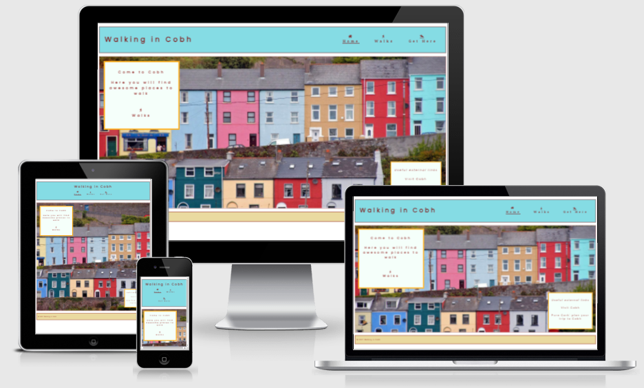

# Walking in Cobh

## Purpose

Walking in Cobh website is dedicated to invite people to visit Cobh. It is intended to invite people who love to walk to come to walk in Cobh.

## Features 

### Existing Features

- __Navigation Menu__

Located where the user expects this kind of element to be located, i.e. on the top of each page, the navigation menu is presented with same colors and same general appearance all over the pages. It is a responsive element and it also gives the users a clue about where they are in the site.

In terms of HTML structure, the navigation menu is a NAV element located in the header section of each page, along with the logo text.

- __The Landing Page__

With a beautiful picture of the Cobh coloured houses, the main section of this page is inviting the user to come to Cobh.

There is a message popping up saying "Come to Cobh" (hero-text). This is the most important message of the landing page. 

In the HTML, the hero-text is a div that is a child of the hero-image div. 

In the CSS, hero-image is positioned with a relative position and hero-text is positioned with an absolute position. This way hero-text is positioned in relation to hero-image.

There is also an aside, named useful-links, child of hero-image. In the CSS, this aside is styled to appear clearly less important than hero-text. It is smaller, not animated, the border is thinner, the stack order is smaller (z-index) and it is positioned in a less priority position in the page.

- __The Footer__

The footer is very simple and with a small copyright text. This text is less relevant in relation to the rest of the website so it is always smaller than the text in the main section and in the header section.

The footer has the same colors and appearance all over the website, like the header.

- __The Walks Page__

...

- __The Get Here Page__

...

### Features Left to Implement

...

## Testing 

...

### Validator Testing 

- HTML
  - No errors were returned when passing through the official [W3C validator](https://validator.w3.org/nu/?doc=https%3A%2F%2Fcode-institute-org.github.io%2Flove-running-2.0%2Findex.html)
- CSS
  - No errors were found when passing through the official [(Jigsaw) validator](https://jigsaw.w3.org/css-validator/validator?uri=https%3A%2F%2Fvalidator.w3.org%2Fnu%2F%3Fdoc%3Dhttps%253A%252F%252Fcode-institute-org.github.io%252Flove-running-2.0%252Findex.html&profile=css3svg&usermedium=all&warning=1&vextwarning=&lang=en#css)

### Unfixed Bugs

...

## Deployment

- The site was deployed to GitHub pages. The steps to deploy are as follows: 
  - In the GitHub repository, navigate first to the Settings tab and then to the GitHub Pages tab.
  - From the source section drop-down menu, select the main branch and then Save this change.

The live link can be found here - https://jmarcosdias.github.io/awesome/index.html 

## Credits 

### Content 

- The icons in the navigation menu were taken from [Font Awesome](https://fontawesome.com/).

### Media

- The photo used on the home page and some other images used in the walks page are taken from [Pixabay](https://pixabay.com). These pictures are free for commercial and noncommercial use.
- Other pictures used in the Walks and in the Get Here pages are non professional photos taken by the developer using his android smartphone.
