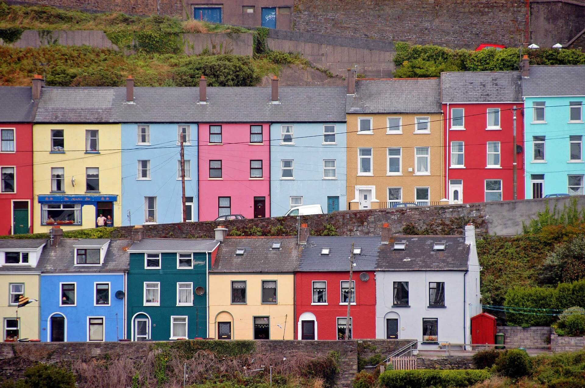
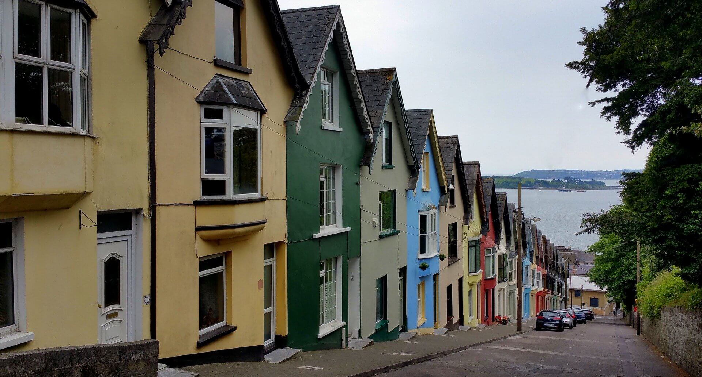

# Walking in Cobh

## Purpose

<em>Walking in Cobh</em> website is dedicated to invite people to visit Cobh. It is intended to invite people who love to walk, to come to walk in Cobh.

## Features 

### Existing Features

- __Navigation Menu__

Located where the user expects this kind of element to be, i.e. on the top of each page, the navigation menu is presented with same colours and same general appearance all over the pages. It is a responsive element and it also gives the users a clue about where they are in the website.

In terms of HTML structure, the navigation menu is a \<nav\> element, located in the header section of each page, along with the logo text which is a heading level 1 element.

- __The Landing Page__

With a beautiful picture of some Cobh coloured houses, the main section of this page is inviting the user to come to Cobh.

There is a message popping up saying "Come to Cobh" (hero-text). This is the most important message of the entire website. 

In the HTML, the hero-text is a \<div\> element that is a child of the hero-image \<div\>.

In the CSS, hero-image is positioned with a relative position while hero-text is positioned with an absolute position. This makes hero-text to be positioned in relation to hero-image.

In the HTML, there is an aside, with id="useful-links", child of hero-image. This element exists to provide some extra and external information that might interest the user.

In the CSS, the useful-links aside is styled to appear clearly less important than the hero-text div. It is smaller, not animated, the border is thinner, the stack order is lower (i.e., it has a lower z-index) and it is positioned in a lower priority location on the page.

In regard to the position attribute of useful-links and the position attribute of its first positioned ancestor, like hero-text, the useful-links element is positioned in relation to hero-image.

- __The Footer__

The footer is a very simple element with a small copyright text. This text is less relevant in relation to the rest of the website, so it is always with a font smaller than the one used in the main and header sections. This will likely favor the user experience.

The footer has the same colours and appearance all over the website, like the header.

- __The Walks Page__

The walks page contains the set of short walks suggested to the users. The idea is that the users will browse this page, see the pictures, read some text if they like and then decide where they want to walk. The first version of <em>Walking in Cobh</em> has only three walks. More walks are expected to be added in further releases.

In terms of HTML, each walk is a \<div\> element with class of walk. It has the following elements inside, in this order:
1. A heading level 2 element. This is the heading of the walk.
2. A \<div\> element with a class of walk-text. This element contains some text about the walk.
3. Two images related to the walk.

The classes defined in the HTML are then used in the CSS code to style the borders, margins, padding, font and colours used in the Walks page, so that this page looks good and harmonizes with the rest of the website.

- __The Get Here Page__

The Get Here page contains:
1. Some external links to Cobh public transportation websites. 
2. A map to help the user to get in Cobh. This map allows the user to initiate and control actions such as zoom in, zoom out and drag the map in any direction. <em>Walking in Cobh</em>  thanks Google for this map.

The colours that appear on the other two pages are used here in this page. This hopefully makes the user experience more familiar and enjoyable.

### Features Left to Implement

In a future release it is possible and expected that more walks will be added to the Walks page.

A survey to collect user's feedback is something that can also be included later. 

## Testing 

The test approach consisted of validating on different browsers and devices, navigating, scrolling, clicking in every link, zooming in and out in the map that is in the Get Here page, changing the size of the viewport and trying to reproduce every scenario a user might come across. This is to ensure that the website is working and looking good in all situations.

For a detailed visual example of some tests that were performed in different devices, please take a look at the Mobile Phone section. In other devices, a similar test was carried out.

### Mobile Phone

Test performed on a smartphone Huawei Mate 20 Lite, using Google Chrome Version 94.0.4606.61. 

                          
                        
                         
                      
     
  
            
                      
                   
                  
                
               

Test Result: Success.

### Laptop

With different display resolutions, the test was successful in the following browsers:

* Google Chrome Version 94.0.4606.71.
* Microsoft Edge Version 94.0.992.38.
* Firefox Version 93.0.

Test Result: 
* Success in Google Chrome, Microsoft Edge and Firefox.
* In the Internet Explorer, the website does not look good.

### Am I Responsive Website

Below are the mockups of the three pages as they can be seen in different devices, using the Am I Responsive website.

                
               
           

Test Result: Success.

### Validator Testing

- HTML
  - No errors were returned when passing the URI of the three pages through the official [W3C Validator](https://validator.w3.org/):
    - https://validator.w3.org/nu/?doc=https%3A%2F%2Fjmarcosdias.github.io%2Fawesome%2Findex.html
    - https://validator.w3.org/nu/?doc=https%3A%2F%2Fjmarcosdias.github.io%2Fawesome%2Fwalks.html
    - https://validator.w3.org/nu/?doc=https%3A%2F%2Fjmarcosdias.github.io%2Fawesome%2Fget-here.html
- CSS
  - No errors were found when passing the URI of the styles.css file through the official [(Jigsaw) Validator](https://jigsaw.w3.org/css-validator/):
    - https://jigsaw.w3.org/css-validator/validator?uri=https%3A%2F%2Fjmarcosdias.github.io%2Fawesome%2Fassets%2Fcss%2Fstyle.css&profile=css3svg&usermedium=all&warning=1&vextwarning=&lang=en

### Unfixed Bugs

The <em>Walking in Cobh</em> website does not look good using Internet Explorer, at least on a laptop. 

Microsoft is retiring Internet Explorer. Anyway, if for some reason <em>Walking in Cobh</em> is required to be used with Internet Explorer, the above issue must be investigated.

About Internet Explorer and Edge:
https://docs.microsoft.com/en-us/lifecycle/faq/internet-explorer-microsoft-edge

## Deployment

The website was deployed to GitHub pages. The steps to deploy are as follows. 

In the GitHub repository:
  - Navigate to the Settings tab 
  - Click on the Pages link on the bottom of the left menu
  - Go to the source section drop-down menu
  - Select the main branch 
  - Save this change

The live link for the Walk in Cobh website can be found [here](https://jmarcosdias.github.io/awesome/).

## Credits 

### Content 

- The icons in the navigation menu were taken from the free section of [Font Awesome](https://fontawesome.com/) icons:

  - https://fontawesome.com/v5.15/icons/home?style=solid
  - https://fontawesome.com/v5.15/icons/walking?style=solid
  - https://fontawesome.com/v5.15/icons/plane-arrival?style=solid

### Media

- The following pictures were taken from [Pixabay](https://pixabay.com). These pictures are free for commercial and noncommercial use:

  - https://pixabay.com/photos/cobh-cove-houses-pastel-285147/  
    

    
  - https://pixabay.com/photos/west-view-house-terrace-cobh-cork-2333252/ 
    

    
  - https://pixabay.com/illustrations/hexagon-diamond-leisure-traveller-1743535/
    

  
- Other pictures used in the Walks page are non professional photos taken by the developer, using his android smartphone.

### iFrame

The map inside the Get Here page is an iFrame with the Google Map of Cobh:
- https://maps.google.com/maps?q=Cobh,Ireland&output=embed

### External Links

- The following external links are used in the Home page:
    - <a href="http://www.visitcobh.com/" target="_blank">Visit Cobh</a> (http://www.visitcobh.com/)
    - <a href="https://purecork.ie/plan-your-trip/about-cork/destinations/cobh" target="_blank">Pure Cork: plan your trip to Cobh</a> (https://purecork.ie/plan-your-trip/about-cork/destinations/cobh)

- The external links below are used in the Get Here page:
  - <a href="https://www.irishrail.ie/en-ie/station/cobh" target="_blank">Irish Rail</a> 
    - https://www.irishrail.ie/en-ie/station/cobh
  - <a href="https://www.cobhconnect.ie/" target="_blank">Cobh Connect</a>
    - https://www.cobhconnect.ie/
  - <a href="http://crossriverferries.ie/" target="_blank">Cross River Ferries</a> 
    - http://crossriverferries.ie/
  - <a href="http://www.acabscobh.ie/" target="_blank">A Cabs Cobh</a> 
    - http://www.acabscobh.ie/
