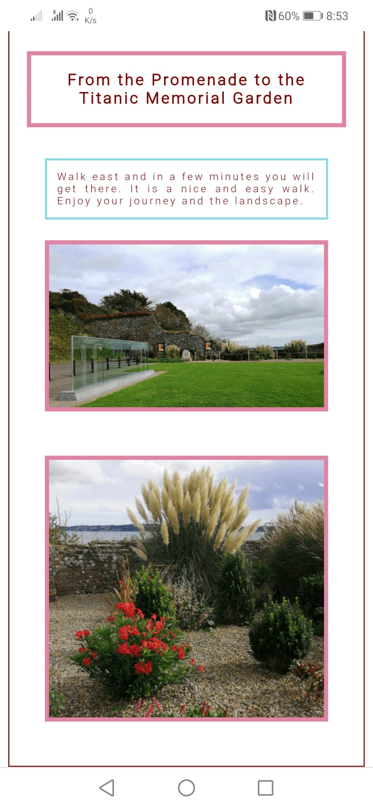

# Walking in Cobh

## Purpose

Walking in Cobh website is dedicated to invite people to visit Cobh. It is intended to invite people who love to walk to come to walk in Cobh.

## Features 

### Existing Features

- __Navigation Menu__

Located where the user expects this kind of element to be located, i.e. on the top of each page, the navigation menu is presented with same colors and same general appearance all over the pages. It is a responsive element and it also gives the users a clue about where they are in the site.

In terms of HTML structure, the navigation menu is a NAV element located in the header section of each page, along with the logo text which is a heading level 1 element.

- __The Landing Page__

With a beautiful picture of the Cobh coloured houses, the main section of this page is inviting the user to come to Cobh.

There is a message popping up saying "Come to Cobh" (hero-text). This is the most important message of the landing page. 

In the HTML, the hero-text is a div that is a child of the hero-image div. 

In the CSS, hero-image is positioned with a relative position and hero-text is positioned with an absolute position. This way hero-text is positioned in relation to hero-image.

In the HTML, there is also an aside, with id useful-links, child of hero-image. This is to provide some external links with information that might interest the user. 

In the CSS, that aside is styled to appear clearly less important than hero-text. It is smaller, not animated, the border is thinner, the stack order is smaller (z-index) and it is positioned in a less priority position in the page.

Like hero-text, the useful-links element is positioned in relation to hero-image.

- __The Footer__

The footer is very simple and with a small copyright text. This text is less relevant in relation to the rest of the website so it is always smaller than the text in the main section and in the header section.

The footer has the same colors and appearance all over the website, like the header.

- __The Walks Page__

The walks page contains the set of short walks that are suggested to the user.

In terms of HTML, each walk is a div element with a class walk. It has a heading level 2 element, which is the heading of the walk, followed by a div with a class walk-text, with some text commenting the walk and finally there are two images related to the walk.

The classes defined in the HTML are then used in the CSS code to style the borders, margins, padding, font and colours so that this section looks integrated in the rest of the website.

- __The Get Here Page__

The Get Here page contains some external links to public transports in Cobh and a map to help the user to get in Cobh. 

The colors that appear on the other two pages are used here to enhance the user experience.

Thanks to Google for the Google Map of Cobh that is placed here by using an iframe.

### Features Left to Implement

In a future release it is possible and expected that more walks will be added to the Walks page.

A survey to collect user's feedback is something that can also be included later. 

## Testing 

The test approach consisted of validating on different browsers and devices, navigating, scrolling, clicking in every link, zooming in and out in the map that is in the Get Here page and changing the size of the viewport, to make sure the website is working and looking good in every situation.

For a detailed visual example of the tests performed in different devices, please take a look at the Mobile Phone section.

### Laptop

With different display resolutions, the test was successful in the following browsers:

* Google Chrome Version 94.0.4606.71
* Microsoft Edge Version 94.0.992.38
* Firefox Version Version 94.0.992.38

Test Result: Success.

### Mobile Phone

Test performed on a smartphone Huawei Mate 20 Lite, using Google Chrome Version 94.0.4606.61. 

                         
                       
                        
                     
    
 
           
                     
                  
                 
               
              

Test Result: Success.

### Am I Responsive Website

Below are the mockups of the three pages as they can be seen in different devices, using the Am I Responsive website.

               
              
          

Test Result: Success.

### Validator Testing -- UNDER CONSTRUCTION - STOPPED HERE 

- HTML
  - No errors were returned when passing the following URI through the official [W3C Validator](https://validator.w3.org/)
    - https://jmarcosdias.github.io/awesome/index.html
    - https://jmarcosdias.github.io/awesome/walks.html
    - https://jmarcosdias.github.io/awesome/get-here.html
- CSS
  - No errors were found when passing the following URI through the official [(Jigsaw) Validator](https://jigsaw.w3.org/css-validator/)
    - https://jmarcosdias.github.io/awesome/assets/css/style.css

### Unfixed Bugs

The Walking in Cobh website does not seem to look good when using Internet Explorer in a laptop. If for some reason is required to use Internet Explorer, this issue must be investigated.

## Deployment

- The site was deployed to GitHub pages. The steps to deploy are as follows:
  - In the GitHub repository, 
  - Navigate to the Settings tab 
  - Scroll down to the GitHub Pages tab
  - 
  - From the source section drop-down menu, select the main branch and then Save this change.

The live link can be found here - https://jmarcosdias.github.io/awesome/index.html 

## Credits 

### Content 

- The icons in the navigation menu were taken from [Font Awesome](https://fontawesome.com/).

### Media

- The photo used on the home page and some other images used in the walks page are taken from [Pixabay](https://pixabay.com). These pictures are free for commercial and noncommercial use.
- Other pictures used in the Walks and in the Get Here pages are non professional photos taken by the developer using his android smartphone.
